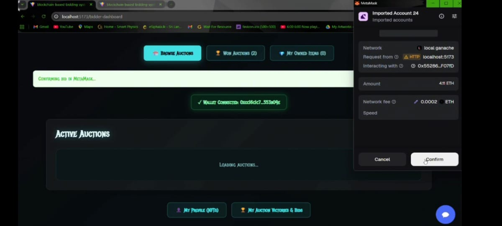
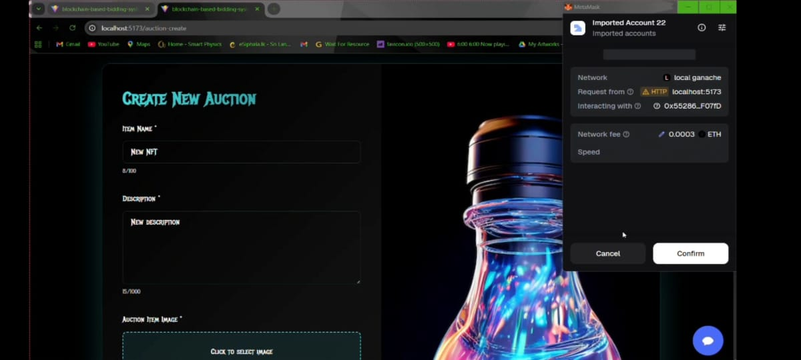

## Evidence

### Screenshot

### Observation

When placing a bid, MetaMask requested transaction confirmation. The transaction details and network fee were displayed before the bid could be submitted.

## Evidence

### MetaMask Confirmation Request

### Observation

While creating a new auction, MetaMask requested transaction confirmation from the user. The transaction displayed gas fees and contract interaction details before submission.