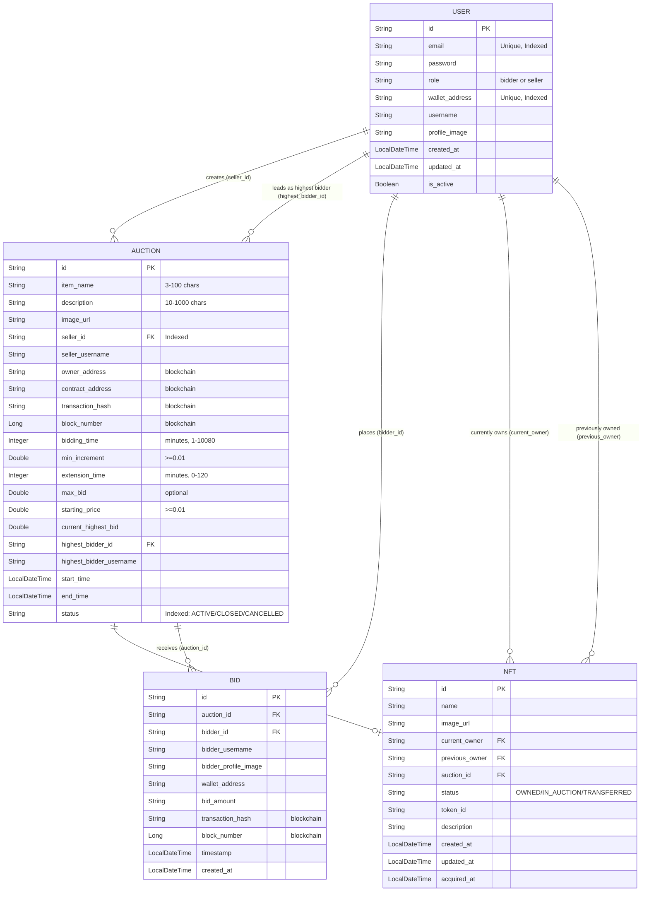

# Documentation
# Blockchain-Based Bidding System

## Project Overview
The Blockchain-Based Bidding System is a decentralized auction platform designed to ensure transparent, secure, and tamper-proof bidding using blockchain technology. The system integrates a web-based frontend, a backend REST API, and Ethereum smart contracts to provide a trustworthy auction environment.

## Main Features

### User Registration and Authentication
- Users can securely register and log in
- Only authenticated users can create auctions and place bids
- Backend manages user verification and access control

### Auction Creation
- Users can create auction listings
- Includes item name, description, starting price, and deadline
- Auction details are stored securely in the backend

### Bidding System
- Users can place bids on active auctions
- Bids are recorded on the blockchain
- Ensures transparency and immutability of bid data

### Real-Time Highest Bid Tracking
- Displays the current highest bid
- Automatically updates when a new highest bid is placed

### Bid History
- Maintains complete bid records
- Allows users to track all bidding activities

### Smart Contract Enforcement
- Auction rules are enforced automatically through smart contracts
- Prevents invalid or lower bids
- Ensures fair winner selection

## User Roles
- Registered users can:
  - Create auction listings
  - Place bids
  - View auction details
  - View bid history
  - Interact securely with the system

## Technologies Used
- React.js
- Spring Boot
- Solidity
- Ethereum-compatible network (Ganache/Testnet)
- Web3.js or Ethers.js
- Node.js and npm
- PostgreSQL or MongoDB (optional)

 
## AI Chatbot (RAG-Based Assistant)

-Developed using a Retrieval-Augmented Generation (RAG) architecture to provide intelligent and domain-specific responses.
-Designed to answer user queries related to the Blockchain-Based Bidding System using internal knowledge files.
-Built with Python and LangChain to manage document ingestion, chunking, embedding, and retrieval.
-Uses Google Gemini (Generative AI API) as the Large Language Model (LLM) for response generation.
-Stores document embeddings in ChromaDB to enable fast and accurate semantic search.
-Splits large documents into smaller overlapping chunks for improved contextual understanding.
-Retrieves the most relevant document chunks before generating responses to reduce hallucination.
-Exposes REST API endpoints using FastAPI for seamless integration with the frontend.
-Designed as a modular AI microservice that can be extended with PDF/DOCX support in the future.
-Future enhancement - Blockchain Wallet Integration – Enable MetaMask-based authentication for secure, wallet-verified chatbot access,Live Smart Contract Interaction – Allow the chatbot to fetch real-time bidding data directly from deployed smart contracts.
 
## AI Chatbot (Node.js Intent Engine)

> **Note:** the frontend currently interacts with a lightweight Node/Express chatbot service. Make sure this service
> is running when you test the UI or the chat box will appear to be unresponsive.

### Backend setup
1. `cd chatbot/backend`
2. `npm install` (or `yarn`)
3. `npm run dev` (starts on port 5000 by default)

The server exposes a POST endpoint at `/api/chat/message` and a GET at `/api/chat/auction-status`.
CORS is enabled so the frontend can call from a different port.

You can verify the Node service with curl:

```bash
curl -X POST http://localhost:5000/api/chat/message \
  -H 'Content-Type: application/json' \
  -d '{"message":"hello"}'
```

(if you switch to the Python backend, use `curl -X POST http://localhost:8000/ask` and
send `{ "question": "hello" }` instead).

### Frontend configuration
The React component uses a couple of environment variables to decide where
it should send chat messages:

* `VITE_CHAT_URL` – full HTTP URL for the POST endpoint. Example:
  `http://localhost:5000/api/chat/message` or
  `http://localhost:8000/ask`.
  When this variable is set it takes absolute precedence.
* `VITE_API_BASE` – base host+port (no path). The component will append
  `/api/chat/message` to this value if `VITE_CHAT_URL` is not provided.
  The default is `http://localhost:5000`.

You can put either variable in a `.env` file at
`frontend/blockchain-based-bidding-system/.env`. For example:

```
VITE_API_BASE=http://localhost:5000
# or, if pointing at the Python service:
# VITE_CHAT_URL=http://localhost:8000/ask
```

The component logs the URL it is using to the browser console, so you can
inspect the output when debugging connectivity problems.

### How it works
- User messages are posted to the configured endpoint.
- The server (Node intent engine or Python RAG) replies with JSON.
- The frontend appends the reply to the message list and scrolls down.

(Previous documentation assumed a Python/RAG service; the default
implementation now is the Node.js microservice described above.)

---

### Optional Python RAG backend
A separate FastAPI service lives under `ai-services/` and drives a retrieval‑augmented chatbot using
LangChain. It is **not required** for the basic intent bot, but you can run it if you want
semantic search/AI responses:

1. Activate a virtualenv in `ai-services/` and install packages (`pip install -r requirements.txt`).
2. Start with `uvicorn app.main:app --reload --port 8000`.
3. Point `VITE_API_BASE` to `http://localhost:8000` instead of port 5000.

If you encounter `ModuleNotFoundError: No module named 'langchain.chains'`, reinstall the dependencies
inside the venv; the README in `ai-services/` contains full setup steps.
 

## Database and Blockchain

### Backend Database
- Stores user information
- Stores auction details
- Stores off-chain auction metadata
- Manages auction status

### Blockchain (Ethereum)
- Stores bid transactions
- Executes smart contract logic
- Ensures transparency and data immutability

## Application Workflow
1. User registers or logs in
2. User creates an auction listing
3. Other users view auction details
4. Users place bids through the smart contract
5. Blockchain records and validates bids
6. Highest bidder wins after auction deadline
7. Auction status is updated

## Security
- Secure authentication using backend services
- Smart contract validation for bid integrity
- Blockchain ensures tamper-proof records
- Proper API security mechanisms

## Future Improvements
- Real-time bid notifications
- Wallet-based authentication (MetaMask login)
- Auction countdown timer
- Admin dashboard
- Deployment to public Ethereum testnet
- Integration with IPFS for decentralized storage

## License
This project is developed for educational purposes and is free to use and modify.


 Blockchain-Based Bidding System with AI Chatbot


A full-stack web application that integrates a **Blockchain-Based Bidding System** with an **AI-powered chatbot** using Google Gemini.


 QUICK START (COPY & RUN)

 Open 2 terminals and copy-paste:

 Terminal 1 (Backend)

```powershell
& "D:\project 5th sem\software\blockchain-based-bidding-system\venv311\Scripts\Activate.ps1"
cd "D:\project 5th sem\software\blockchain-based-bidding-system\ai-services"
uvicorn app.main:app --reload --host 127.0.0.1 --port 5000

Terminal 2 (Frontend)
cd "D:\project 5th sem\software\blockchain-based-bidding-system\frontend\blockchain-based-bidding-system"
npm run dev