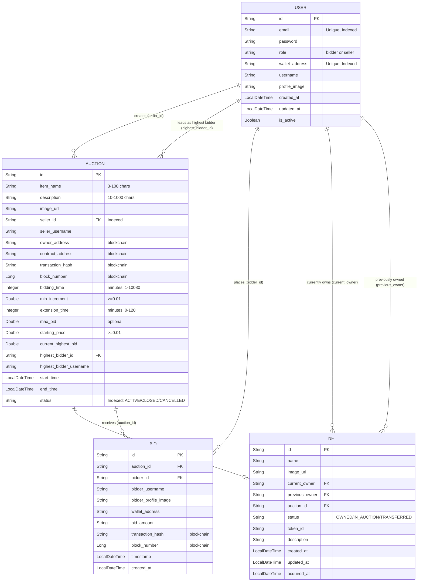

# Documentation
# Blockchain-Based Bidding System

## Project Overview
The Blockchain-Based Bidding System is a decentralized auction platform designed to ensure transparent, secure, and tamper-proof bidding using blockchain technology. The system integrates a web-based frontend, a backend REST API, and Ethereum smart contracts to provide a trustworthy auction environment.

## Main Features

### User Registration and Authentication
- Users can securely register and log in
- Only authenticated users can create auctions and place bids
- Backend manages user verification and access control

### Auction Creation
- Users can create auction listings
- Includes item name, description, starting price, and deadline
- Auction details are stored securely in the backend

### Bidding System
- Users can place bids on active auctions
- Bids are recorded on the blockchain
- Ensures transparency and immutability of bid data

### Real-Time Highest Bid Tracking
- Displays the current highest bid
- Automatically updates when a new highest bid is placed

### Bid History
- Maintains complete bid records
- Allows users to track all bidding activities

### Smart Contract Enforcement
- Auction rules are enforced automatically through smart contracts
- Prevents invalid or lower bids
- Ensures fair winner selection

## User Roles
- Registered users can:
  - Create auction listings
  - Place bids
  - View auction details
  - View bid history
  - Interact securely with the system

## Technologies Used
- React.js
- Spring Boot
- Solidity
- Ethereum-compatible network (Ganache/Testnet)
- Web3.js or Ethers.js
- Node.js and npm
- PostgreSQL or MongoDB (optional)

## Database and Blockchain

### Backend Database
- Stores user information
- Stores auction details
- Stores off-chain auction metadata
- Manages auction status

### Blockchain (Ethereum)
- Stores bid transactions
- Executes smart contract logic
- Ensures transparency and data immutability

## Application Workflow
1. User registers or logs in
2. User creates an auction listing
3. Other users view auction details
4. Users place bids through the smart contract
5. Blockchain records and validates bids
6. Highest bidder wins after auction deadline
7. Auction status is updated

## Security
- Secure authentication using backend services
- Smart contract validation for bid integrity
- Blockchain ensures tamper-proof records
- Proper API security mechanisms

## Future Improvements
- Real-time bid notifications
- Wallet-based authentication (MetaMask login)
- Auction countdown timer
- Admin dashboard
- Deployment to public Ethereum testnet
- Integration with IPFS for decentralized storage

## License
This project is developed for educational purposes and is free to use and modify.
